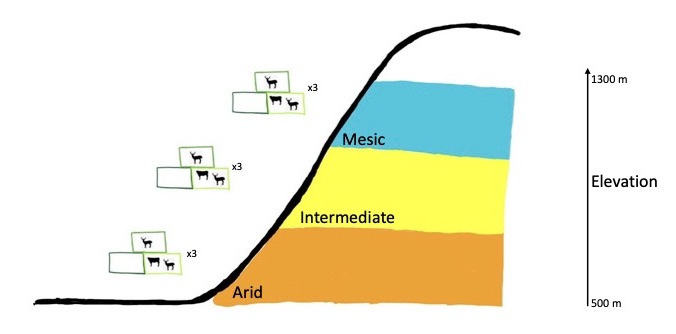

### Post

These visualizations are a continuation of the data analysis from the Tejon Ranch Exclusion Experiment (TREE) that was also seen in the ESM 244 group project Shiny App. TREE sought to experimentally understand the interactive impacts of wild ungulate removal and replacement over a climatic gradient to ecosystem structure and function. This was achieved using replicated 1 hectare exclosure treatments along a topographical gradient (see study site drawing (again), below). 

One aspect of this project studied the separate and interactive impacts of climate and herbivore removal on tick abundance. Tick-borne diseases are the most common vector-borne diseases in the United States to both humans and domestic animals. The uniqueness of the tick life cycle, requiring both an on-host and off-host stage, make ticks particularly sensitive to ecosystem-level changes.  

The study found that large herbivore removal increased tick abundance and that climatic context was significant to this interaction. This study (Copeland et al.) is set to be reviewed and submitted to the *Journal of Ecological Applications*.

Thank you to co-author's Sam Sambado and Dr. Devyn Orr for their assistance in data cleaning and analysis for the manuscript. Thank you to Sam for her help with figures 1 and 2 and introducing me to the `ggarange` (figure 1) and `scale_x_discrete(labels = )` in figure 2!



```{r setup, include=TRUE, warning = FALSE, message=FALSE}
knitr::opts_chunk$set(echo = TRUE, message = FALSE, warning = FALSE)
library(tidyverse)
library(ggpubr)
library(ggplot2)
library(ggfortify)

```

**Figure 1**

```{r}
Tick <- read_csv("Tejon_clean-main/data_visualizations/Viz_Tejon_MeanComparisons_Dataset.csv")

# omit 0s to make plots 
Tick_no0 <- Tick[which(Tick$total != 0),]

plot1 <- ggplot(Tick_no0, aes(x = plot, y = log(total), fill = plot))+
  geom_jitter(alpha = .15, width = .2)+
  geom_boxplot()+
  theme_bw() +
  labs(x = 'Plot', y = 'log(Total ticks) 2016 - 2019')+
  scale_fill_manual(values=c('palegreen1','palegreen3','palegreen4'))+
  guides(fill = FALSE)

site1 <-ggplot(Tick_no0, aes(x = site, y = log(total), fill = site))+
  geom_jitter(alpha = .15, width = .2)+
  geom_boxplot() +
  theme_bw() +
  labs(x = 'Site', y = 'log(Total ticks) 2016 - 2019')+
  scale_fill_manual(values=c('darkorange2','gold','cadetblue3'))+
  guides(fill = FALSE)

var_plot <-ggarrange(plot1, site1)

var_plot

```
*Figure 1:* Log of Total Tick Counts separated by Exclusion Treatment and Climate. Both Exclosures (Partial and Total) had greater tick abundances than the open control. The 'Intermediate' climate had the greatest tick abundances than the other two climatic zones.

**Figure 2**

```{r}
Tick$month <- factor(Tick$month, 
                        levels = c('January', 'February', 'March',
                                   'April', 'May', 'June', 'July',
                                   'August', 'September', 'October',
                                   'November', 'December'))

ggplot(Tick, aes(x = site, y = log(total), fill = plot))+
  facet_wrap(~ month, ncol = 6)+
  #geom_jitter(alpha = .35, width = .2)+
  #geom_boxplot()+
  geom_bar(stat = "identity", position = "dodge")+
  theme_bw() +
  scale_x_discrete(labels = c('A','I','M')) +
  labs(x = 'Site', y = 'Log of tick counts (2016 - 2019)')+
  scale_fill_manual(values=c('palegreen1','palegreen3','palegreen4'))
```
*Figure 2:* Log of monthly tick counts separated by Climate zone and Exclusion Treatment. There is a component of seasonality to tick abundance with noted increases and peaks in abundance during the early spring and mid-to-late fall. This is likely due to the importance of temperature and humidity on tick activity. It's likely that during the summer and early fall, it becomes too hot and dry for tick questing activity. They enter a behavioral diapause and are therefore not collected by drag cloths that target questing adult ticks. 

