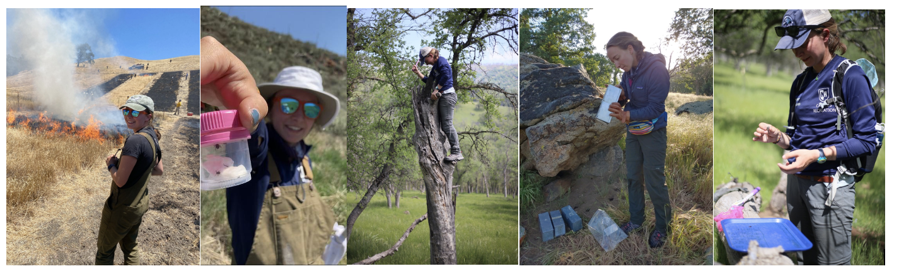

```{r setup, include=FALSE}
knitr::opts_chunk$set(echo = FALSE)
#install.packages("xfun")
library(xfun)
```

```{r, out.width = "800px"}


```

## About Me

## My Science

### Tejon Ranch Exclosure Experiment

### Sedgwick Reserve Prescribed Burn

### Sierra Nevada Alpine Mosquito Project

## Opportunities

I am looking for 1-2 motivated undergraduates interested in independent research experience to join me on an approximately 6 week long field season this summer (2022). The field work will occur at several pairs of high alpine lakes. Each pair contains one lake artificially stocked with fish, the other is un-stocked (no fish). Research questions can take on a variety of different topics, as long as they are focused on this high alpine lake habitat. Please reach out to me via email if you're interested.
